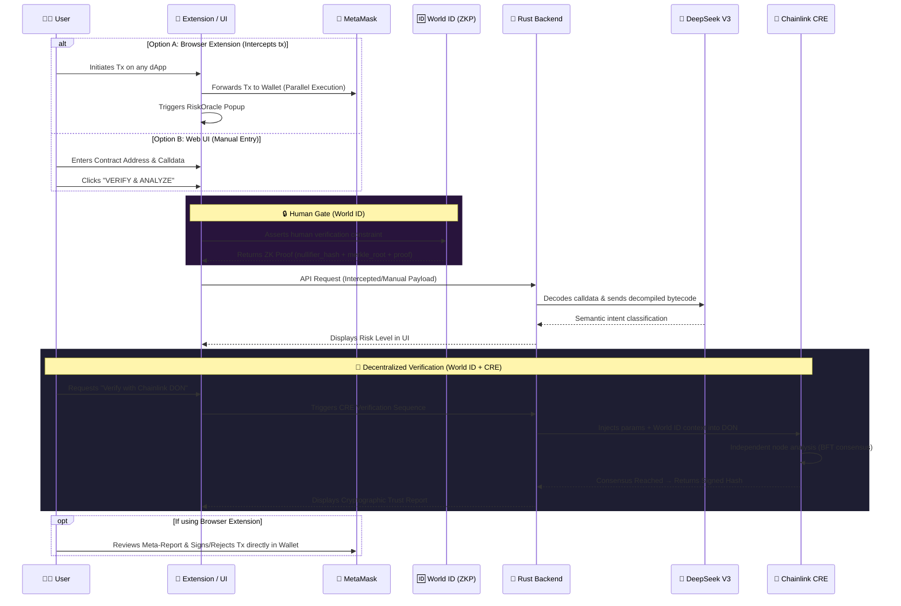

<div align="center">

# 🛡️ RiskOracle

**The First Human-Gated, AI-Powered, Decentralized Transaction Security Layer**

[](https://www.rust-lang.org/)
[](https://react.dev/)
[](https://chain.link/)
[](https://www.deepseek.com/)
[](https://worldcoin.org/)

*Built for [Convergence: A Chainlink Hackathon](https://chain.link/hackathon)*

</div>

---

## 🎥 Video Demo

<div align="center">
  <a href="https://youtu.be/J3FweK-15EE">
    
  </a>
</div>

---

## 👁️ Table of Contents

- [👁️ The Oracle's Vision](#️-the-oracles-vision)
- [🏆 Hackathon Tracks](#-hackathon-tracks)
- [🆔 World ID Integration (Sybil-Resistant Human Gate)](#-world-id-integration-sybil-resistant-human-gate)
- [🔑 Unmatched Benefits](#-unmatched-benefits)
- [🌊 Application Flow](#-application-flow)
- [🏛️ Architecture](#️-architecture)
- [🚦 Risk Scoring System](#-risk-scoring-system)
- [🛠️ Quick Start & Installation](#️-quick-start--installation)
  - [🚀 Install the RiskOracle Browser Extension (Guardian)](#4-install-the-riskoracle-browser-extension-guardian)
- [🧪 Live Testing (Arbitrum Sepolia)](#-live-testing-arbitrum-sepolia)
- [👥 Team](#-team)

---

## 👁️ The Oracle's Vision

In the rapidly evolving world of decentralized finance, uncertainty is the enemy. Over **$3.1B** was lost to hacks and scams in H1 2025 alone — a staggering **+1,025%** increase from the previous year — with **84%** starting as simple `approve()` or malicious contract interactions. Users are forced to sign complex hex data blindfolded.

**RiskOracle** is the answer: a **human-gated**, AI-powered security layer (delivered as an intuitive **Browser Extension**) that stands directly between your wallet and catastrophe. By combining:

- ⚡ **Sub-millisecond Rust decoding** for raw calldata extraction,
- 🧠 **DeepSeek V3 AI** for semantic intent analysis,
- 🔗 **Chainlink CRE (DON)** for decentralized, verifiable consensus,
- 🆔 **World ID (Zero-Knowledge Proof)** to ensure only verified humans consume backend resources,

...we decode the true intent of every transaction and verify it decentrally — ***before* you sign.**

**SECURE // DECENTRALIZE // VERIFY**

---

## 🏆 Hackathon Tracks

We built RiskOracle pushing beyond the standard stack to deliver a production-grade Web3 firewall. We are competing for:

### 1. ⚖️ Risk & Compliance
RiskOracle directly addresses the **$3.1B+ loss** crisis in DeFi by functioning as an intelligent, pre-execution browser security layer. Instead of auditing after the hack or expecting users to copy-paste hex data into external tools, our **Guardian Extension** intercepts `eth_sendTransaction` calls directly from the browser's provider object (e.g. MetaMask). It offers real-time compliance and risk analysis of the semantic intent *before* any signature is executed. Our Rust-powered decoder extracts calldata in sub-millisecond time, while DeepSeek V3 classifies malicious patterns — making it a frictionless security primitive for Web3 mass adoption.

### 2. 🧠 CRE & AI
We took **Chainlink's CRE** (natively TS/Go) and pushed its limits by seamlessly orchestrating it within a blisteringly fast **Rust backend** via a custom cross-language bridge. This pipeline powers a decentralized verification flow where **DeepSeek V3** analyzes raw bytecode semantics, and multiple oracle nodes within the CRE Runtime Environment independently evaluate the data to reach a **BFT consensus** on the transaction's risk level.

### 3. 🏅 Top 10 Projects
RiskOracle is a polished, production-ready, end-to-end solution. Instead of a standalone dashboard, we built a non-blocking **Browser Extension (Web3 Guardian)** that wraps the standard Ethereum provider. It intercepts wallet transactions on the fly, enforces a **World ID** human gate, and triggers the Rust+DeepSeek+CRE pipeline natively in parallel with the MetaMask popup. It also features a highly aesthetic cyberpunk UI, a Landing Page (`frontend`), and a functional **Phishing Demo dApp** (`test_front_contract`) that allows judges to experience a real attack-and-defense flow live in the browser.

### 4. 🆔 Best Use of World ID with CRE
RiskOracle integrates **World ID** — World's protocol for privacy-preserving proof of unique humanness — directly with **Chainlink CRE** to create a human-gated, decentralized security pipeline. Users must pass a Zero-Knowledge Proof verification before any analysis is triggered, providing Sybil resistance at the application layer. The ZK proof then unlocks the CRE-powered verification pipeline, where the proof context is injected into the DON simulation for consensus — demonstrating World ID usage beyond its natively supported chains via off-chain verification within CRE.

---

## 🆔 World ID Integration (Sybil-Resistant Human Gate)

RiskOracle is one of the first security tools to gate its entire analysis pipeline behind **World ID** verification. This is not just a login — it's a fundamental security primitive:

### Why World ID?
| Problem | Our Solution |
|---------|-------------|
| Bots and scripts can DDoS expensive AI analysis endpoints. | Only **verified humans** can trigger DeepSeek + Chainlink resources. |
| Sybil attacks can flood risk scoring systems with fake requests. | World ID's **Zero-Knowledge Proofs** ensure one-human-one-request uniqueness. |
| Traditional auth exposes user identity (email, wallet). | ZKP verification proves humanity **without revealing any personal data**. |

### How It Works
1. The user enters a contract address and calldata in the RiskOracle UI.
2. Clicking **"VERIFY & ANALYZE RISK"** triggers the World ID widget.
3. The user scans a QR code with their **World App** (or uses device-level verification).
4. World ID returns a **Zero-Knowledge Proof** (nullifier hash, Merkle root, and cryptographic proof).
5. Upon successful verification, the analysis pipeline (Rust → DeepSeek → Chainlink) is unlocked.
6. The user's unique anonymous identifier (derived from the ZKP `nullifier_hash`) is displayed as a verified badge on the results panel.

> **Privacy by design**: World ID never shares your name, email, or wallet address. RiskOracle only receives a cryptographic proof that you are a unique, verified human.

---

## 🔑 Unmatched Benefits

### 🛡️ 1. Prevent Catastrophic Losses (AI-Powered)
Stop relying on luck. Our system uses a high-performance **Rust** engine linked with **DeepSeek V3** to decompile, decode, and analyze raw calldata. We instantly detect:
- 🛑 Reentrancy vulnerabilities
- 💸 Malicious fund redirection & honeypots
- 🎭 Proxy implementation risks
- 🔓 Unauthorized state modifications

### ⚖️ 2. Verifiable Decentralized Consensus (Chainlink DON)
Why trust a single centralized API? After the initial scan, users can request a **Decentralized Audit**:
- **Independent Node Analysis**: Multiple nodes in a Chainlink Runtime Environment independently analyze the contract.
- **BFT Consensus**: The network reaches a Byzantine Fault Tolerant consensus on the risk level.
- **Cryptographic Trust**: The final result is hashed and signed, guaranteeing unbiased, tamper-proof security reports.

### 🆔 3. Human-Gated Security (World ID)
Every analysis request is gated by a **World ID Zero-Knowledge Proof**. This ensures:
- No bots, no scripts, no Sybil attacks.
- Privacy-preserving: your identity is never exposed.
- Each verified human gets a unique, anonymous session identifier.

### ⚡ 4. Frictionless, Lightning-Fast UX
- **Built for Speed**: The core decoder is written purely in **Rust** (memory-safe, zero garbage collection) for sub-millisecond responsiveness.
- **Cyber-Premium Interface**: A modern, glassmorphism-based React frontend that transforms terrifying hex data into human-readable logic.

---

## 🌊 Application Flow


```mermaid
sequenceDiagram
    participant User as 🧑‍💻 User
    participant Ext as 🧩 Extension / UI
    participant Meta as 🦊 MetaMask
    participant WorldID as 🆔 World ID (ZKP)
    participant Rust as 🦀 Rust Backend
    participant AI as 🧠 DeepSeek V3
    participant CRE as 🔗 Chainlink CRE

    alt Option A: Browser Extension (Intercepts tx)
        User->>Ext: Initiates Tx on any dApp
        Ext->>Meta: Forwards Tx to Wallet (Parallel Execution)
        Ext->>Ext: Triggers RiskOracle Popup
    else Option B: Web UI (Manual Entry)
        User->>Ext: Enters Contract Address & Calldata
        User->>Ext: Clicks "VERIFY & ANALYZE"
    end

    rect rgb(40, 20, 60)
        Note over Ext,WorldID: 🔒 Human Gate (World ID)
        Ext->>WorldID: Asserts human verification constraint
        WorldID-->>Ext: Returns ZK Proof (nullifier_hash + merkle_root + proof)
    end

    Ext->>Rust: API Request (Intercepted/Manual Payload)
    Rust->>AI: Decodes calldata & sends decompiled bytecode
    AI-->>Rust: Semantic intent classification
    Rust-->>Ext: Displays Risk Level in UI

    rect rgb(30, 30, 50)
        Note over User,CRE: 🔗 Decentralized Verification (World ID + CRE)
        User->>Ext: Requests "Verify with Chainlink DON"
        Ext->>Rust: Triggers CRE Verification Sequence
        Rust->>CRE: Injects params + World ID context into DON
        CRE->>CRE: Independent node analysis (BFT consensus)
        CRE-->>Rust: Consensus Reached → Returns Signed Hash
        Rust-->>Ext: Displays Cryptographic Trust Report
    end

    opt If using Browser Extension
        User->>Meta: Reviews Meta-Report & Signs/Rejects Tx directly in Wallet
    end
```

---

## 🏛️ Architecture

RiskOracle combines the best of Web3, AI, and Systems Programming:

1. **Frontend Extension (Guardian)**: React + Vite injected via Content Scripts. Intercepts `window.ethereum` dynamically.
2. **Human Gate**: World ID (`@worldcoin/idkit`) — Zero-Knowledge Proof verification layer.
3. **Core Decoder**: Rust (Actix-Web) for blisteringly fast API handling and data parsing.
4. **Semantic Brain**: DeepSeek V3 integrated via API to understand the "why" behind the code.
5. **Trust Layer**: Chainlink Decentralized Oracle Network (DON) consensus via the Chainlink Runtime Environment (CRE).

### 🌉 The Rust-to-CRE Bridge (Solving Language Constraints)

Chainlink CRE natively supports TypeScript and Go through its SDKs. To leverage the extreme performance of our **Rust backend** alongside the decentralization of CRE, we architected a custom bridging solution in the `/cre` and `/rust_backend` directories:

- **Dynamic State Management**: When a verification is requested, the Rust backend dynamically mutates the `config.staging.json` in the `/cre` environment with the specific unverified contract parameters.
- **Asynchronous Subprocess CLI Execution**: The Rust environment uses `tokio::process::Command` to spin up a detached instance of the `cre workflow simulate` CLI tool, mimicking a real DON trigger event natively within the host machine.
- **Cross-Lingual Data Piping**: Rust captures the `stdout/stderr` streams from the TypeScript-based CRE engine in real-time, extracts the nested `Workflow Simulation Result` via custom zero-copy parsing, and calculates a SHA-256 cryptographic hash representation for final user delivery.

This pipeline effectively brings Chainlink's Decentralized Oracle infrastructure directly into the heart of a high-performance Rust server.

---

## 🚦 Risk Scoring System

RiskOracle translates complex bytecode into a clear, actionable traffic-light system:

- 🔴 **CRITICAL**: High probability of immediate fund loss (e.g., wallet drainers, honeypots).
- 🟠 **HIGH**: Dangerous functions detected without proper safeguards. Proceed with extreme caution.
- 🟡 **MEDIUM**: Complex logic or proxy patterns detected. Review carefully.
- 🟢 **LOW**: Standard, well-understood, and safe token standards (e.g., standard ERC-20/ERC-721).

---

## 🛠️ Quick Start & Installation

### Prerequisites
- `Node.js` & `npm`
- `Rust` & `Cargo`
- Chainlink CRE CLI (`npm install -g @chainlink/cre`)
- A [World App](https://worldcoin.org/download) account (for World ID verification)

### 1. Clone & Configure
```bash
git clone https://github.com/Oriojas/RiskOracle.git
cd RiskOracle
```

Create a `.env` file in the `rust_backend/` directory:
```env
DEEPSEEK_API_KEY=your_deepseek_api_key_here
ARBISCAN_API_KEY=your_arbiscan_key_here_for_abi_fetching
```

> **Note**: The World ID `app_id` is configured in the frontend component. For production, this should also be moved to an environment variable.

### 2. Ignite the Rust Core (Backend)
```bash
cd rust_backend
cargo run
# The decoder boots up at http://localhost:8080
```

### 3. Launch the Oracle Interface (Frontend)
```bash
cd frontend
npm install
npm run dev
# The cyber-UI goes live at http://localhost:5173
```

### 4. Install the RiskOracle Browser Extension (Guardian)
The true power of RiskOracle is fighting malicious transactions right at the source without interrupting your standard wallet flow.
1. In the terminal, build the extension:
```bash
cd extension
npm install
npm run build
```
2. Open Google Chrome (or any Chromium browser).
3. Navigate to `chrome://extensions/`.
4. Enable **"Developer mode"** in the top right corner.
5. Click **"Load unpacked"**.
6. Select the `extension/dist` folder inside your cloned `RiskOracle` repository.
7. *The extension is now active! It will automatically intercept any transactions initiated in the test dApp (Step 5).*

### 5. Launch the Phishing Demo (Test dApp)
We included a realistic "Malicious Airdrop" dApp to test the Oracle in real time.
```bash
cd test_front_contract
npm install
npm run dev
# The demo phishing site goes live at http://localhost:5174
```

---

## 🧪 Live Testing (Arbitrum Sepolia)

We have deployed test contracts specifically for judges and users to experience RiskOracle. Currently optimized for the Arbitrum Sepolia network (verified contracts only).

| Status | Name | Contract Address | Calldata | Expected Result |
|--------|------|------------------|----------|-----------------|
| 🟢 | `SimpleCounter` | `0xd77b2520fa076800C31Aa6884cE9BC1AFdd33B27` | `0xd09de08a` | Safe increment logic. |
| 🟡 | `Vault` | `0xD448ABBd7aF5C6253130975d9cC0a063C071dfD6` | `0xd0e30db0` | Medium risk. Deposit/Withdraw complex logic. |
| 🔴 | **`HighRiskVault`** | `0x4aB3f90B12b1Bd7653EBC4bC5702078F0Bf67fBd` | `0x6a2a530a` | **CRITICAL**. Fake deposit. Redirects funds instantly to a hardcoded wallet. |

---

## 👥 Team

| Member | Role | Link |
|--------|------|------|
| **Oscar** | Backend & AI Integration | [GitHub](https://github.com/Oriojas) |
| **Jhon** | Frontend UX | [GitHub](https://github.com/jhontejada95) |
| **Antigravity** | AI Core Assistant | [Official Site](https://antigravity.google/) |

---

<div align="center">

*Protecting the frontier. Built by Coders and AI.*

*Powered by Chainlink CRE · DeepSeek V3 · Rust · World ID*

**SECURE // DECENTRALIZE // VERIFY**

</div>
