<div align="center">

# 🛡️ RiskOracle

**The Ultimate AI-Powered, Decentralized Transaction Security Layer**

[](https://www.rust-lang.org/)
[](https://react.dev/)
[](https://chain.link/)
[](https://www.deepseek.com/)

*Built for the Chainlink Block Magic Hackathon*

</div>

---

## 👁️ The Oracle's Vision

In the rapidly evolving world of decentralized finance, uncertainty is the enemy. Over **$1.8B+** was lost to hacks in 2024 alone, with **84%** starting as simple 'approve' or malicious contract interactions. Users are forced to sign complex hex data blindfolded. 

**RiskOracle** acts as an intelligent intermediary. By combining sub-millisecond Rust-based decoding with DeepSeek's advanced AI and Chainlink's Decentralized Oracle Networks (DONs), we decode the semantic intent of every transaction and verify it decentrally *before* you sign.

**SECURE // DECENTRALIZE // VERIFY**

---

## 🏆 Hackathon Prizes We Are Targeting

We built RiskOracle pushing beyond the standard stack to deliver a production-grade Web3 firewall. We are competing for:

### 1. Risk & Compliance
RiskOracle directly attacks the massive $3.1B+ loss problem in DeFi by functioning as an intelligent, pre-execution defense layer. Instead of auditing after the hack, we offer real-time compliance and risk analysis of the semantic intent *before* any signature is executed, making it a critical primitive for Web3 mass adoption.

### 2. CRE & AI
We took **Chainlink's CRE** (native to TS/Go) and pushed its limits by seamlessly orchestrating it within a blisteringly fast **Rust backend**. This bridge powers a decentralized verification pipeline where the advanced cognitive capabilities of **DeepSeek V3 (AI)** analyze the raw bytecode logic, and multiple oracles use this data via the Runtime Environment to form a decentralized consensus on the risk level.

### 3. Top 10 Projects
RiskOracle is a polished, end-to-end solution: 
- Highly aesthetic, cyberpunk UI that transforms terrifying hex data into human-readable alerts.
- A robust Rust microservice backend engineered for sub-millisecond data extraction.
- A functional, interactive **Phishing Demo dApp (`test_front_contract`)** allowing judges to experience the attack and defense flow live!

---

## � Unmatched Benefits

### 🛡️ 1. Prevent Catastrophic Losses (AI-Powered)
Stop relying on luck. Our system uses a high-performance **Rust** engine linked with **DeepSeek-V3** to decompile, decode, and analyze raw calldata. We instantly detect:
- 🛑 Reentrancy vulnerabilities
- 💸 Malicious fund redirection & HoneyPots
- 🎭 Proxy implementation risks
- 🔓 Unauthorized state modifications

### ⚖️ 2. Verifiable Decentralized Consensus (Chainlink DON)
Why trust a single centralized API? After the initial scan, users can request a **Decentralized Audit**.
- **Independent Node Analysis**: Multiple nodes in a Chainlink Runtime Environment independently analyze the contract.
- **BFT Consensus**: The network reaches a Byzantine Fault Tolerant consensus on the risk level.
- **Cryptographic Trust**: The final result is hashed and signed, guaranteeing unbiased, tamper-proof security reports.

### ⚡ 3. Frictionless, Lightning-Fast UX
- **Built for Speed**: The core decoder is written purely in **Rust** (memory-safe, zero garbage collection) for sub-millisecond responsiveness.
- **Cyber-Premium Interface**: A modern, glassmorphism-based React frontend that transforms terrifying hex data into human-readable logic.

---

## 🌊 Application Flow

```mermaid
sequenceDiagram
    participant User as 🧑‍💻 User
    participant UI as 🖥️ RiskOracle UI
    participant Rust as 🦀 Rust Backend
    participant AI as 🧠 DeepSeek AI
    participant CRE as 🔗 Chainlink CRE

    User->>UI: Enters Contract Address & Calldata
    UI->>Rust: API Request (Decode & Analyze)
    Rust->>AI: Sends decompiled bytecode for semantic analysis
    AI-->>Rust: Returns vulnerability report & intent
    Rust-->>UI: Displays Initial Risk Score (Red/Yellow/Green)
    
    rect rgb(30, 30, 50)
        Note over User,CRE: Optional: Decentralized Verification
        User->>UI: Requests "Verify with Chainlink DON"
        UI->>Rust: Triggers Verification Sequence
        Rust->>CRE: Injects params & spawns local DON simulation
        CRE-->>Rust: BFT Consensus Reached. Returns Hash
        Rust-->>UI: Displays Cryptographic Trust Report
    end
```



---

## 🏛️ Architecture

RiskOracle combines the best of Web3, AI, and Systems Programming:

1. **Frontend**: React + Vite + Vanilla CSS (Premium Cyber-Web3 Aesthetic).
2. **Core Decoder**: Rust (Actix-Web) for blisteringly fast API handling and data parsing.
3. **Semantic Brain**: DeepSeek-V3 integrated via API to understand the "why" behind the code.
4. **Trust Layer**: Chainlink Decentralized Oracle Network (DON) consensus via the Chainlink Runtime Environment (CRE).

### 🌉 The Rust-to-CRE Bridge (Solving Language Constraints)

Chainlink CRE natively supports TypeScript and Go through its SDKs. To leverage the extreme performance of our **Rust backend** alongside the decentralization of CRE, we architected a custom bridging solution in the `/cre` and `/rust_backend` directories:

- **Dynamic State Management**: When a verification is requested, the Rust backend dynamically mutates the `config.staging.json` in the `/cre` environment with the specific unverified contract parameters.
- **Asynchronous Subprocess CLI Execution**: The Rust environment uses `tokio::process::Command` to spin up a detached instance of the `cre workflow simulate` CLI tool, mimicking a real DON trigger event natively within the host machine.
- **Cross-Lingual Data Piping**: Rust captures the `stdout/stderr` streams from the TypeScript-based CRE engine in real-time, extracts the nested `Workflow Simulation Result` via custom zero-copy parsing, and calculates a SHA-256 cryptographic hash representation for final user delivery.

This pipeline effectively brings Chainlink's Decentralized Oracle infrastructure directly into the heart of a high-performance Rust server.

---

## 🚦 Risk Scoring System

RiskOracle translates complex bytecode into a clear, actionable traffic-light system:

- 🔴 **CRITICAL**: High probability of immediate fund loss (e.g., wallet drainers, honeypots).
- 🟠 **HIGH**: Dangerous functions detected without proper safeguards. Proceed with extreme caution.
- 🟡 **MEDIUM**: Complex logic or proxy patterns detected. Review carefully.
- 🟢 **LOW**: Standard, well-understood, and safe token standards (e.g., standard ERC20/721).

---

## 🛠️ Quick Start & Installation

### Prerequisites
- `Node.js` & `npm`
- `Rust` & `Cargo`
- Chainlink CRE CLI (`npm install -g @chainlink/cre`)

### 1. Clone & Configure
```bash
git clone https://github.com/Oriojas/RiskOracle.git
cd RiskOracle
```
Create a `.env` file in the `rust_backend/` directory:
```env
DEEPSEEK_API_KEY=your_deepseek_api_key_here
ARBISCAN_API_KEY=your_arbiscan_key_here_for_abi_fetching
```

### 2. Ignite the Rust Core (Backend)
```bash
cd rust_backend
cargo run
# The decoder boots up at http://localhost:8080
```

### 3. Launch the Oracle Interface (Frontend)
```bash
cd frontend
npm install
npm run dev
# The cyber-ui goes live at http://localhost:5173
```

### 4. Launch the Phishing Demo (Test dApp)
We included a realistic 'Malicious Airdrop' dApp to test the Oracle in real time.
```bash
cd test_front_contract
npm install
npm run dev
# The demo phishing site goes live at http://localhost:5174
```

---

## 🧪 Live Testing (Arbitrum Sepolia)

We have deployed test contracts specifically for you to experience the RiskOracle. Currently optimized for the Arbitrum network (verified contracts only).

| Status | Name | Contract Address | Calldata | Expected Result |
|--------|------|------------------|----------|-----------------|
| 🟢 | `SimpleCounter` | `0xd77b2520fa076800C31Aa6884cE9BC1AFdd33B27` | `0xd09de08a` | Safe increment logic. |
| � | `Vault` | `0xD448ABBd7aF5C6253130975d9cC0a063C071dfD6` | `0xd0e30db0` | Medium risk. Deposit/Withdraw complex logic. |
| 🔴 | **`HighRiskVault`** | `0x4aB3f90B12b1Bd7653EBC4bC5702078F0Bf67fBd`| `0x6a2a530a` | **CRITICAL**. Fake deposit. Redirects funds instantly to a hardcoded wallet. |

---

<div align="center">
<i>Protecting the frontier. Built by Vibecoders. Powered by DeepSeek, Rust & Chainlink.</i>
</div>
